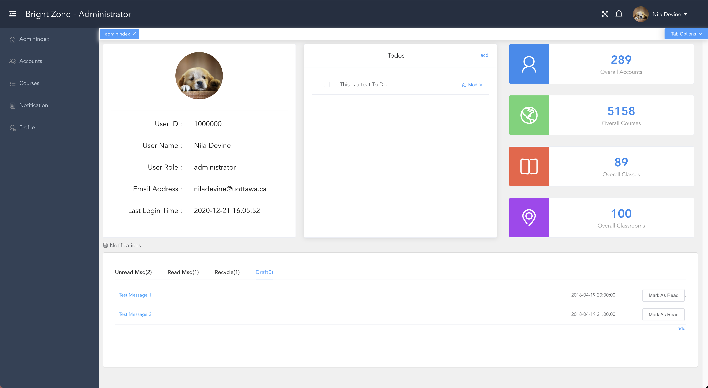
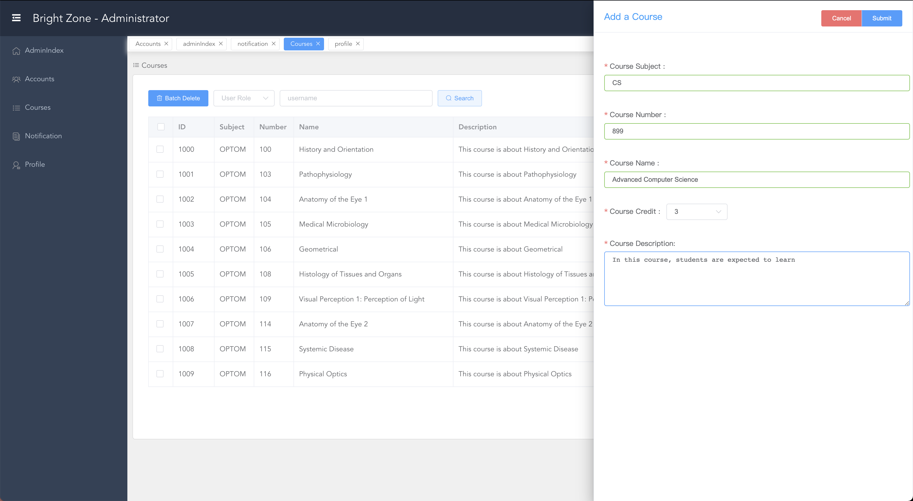
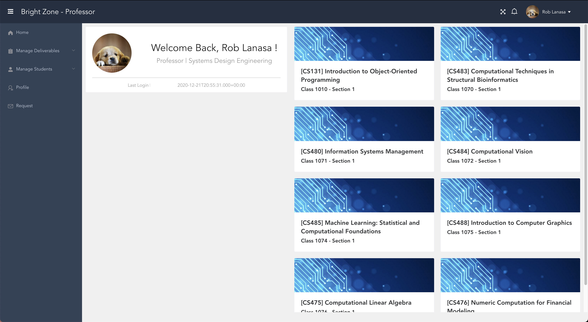
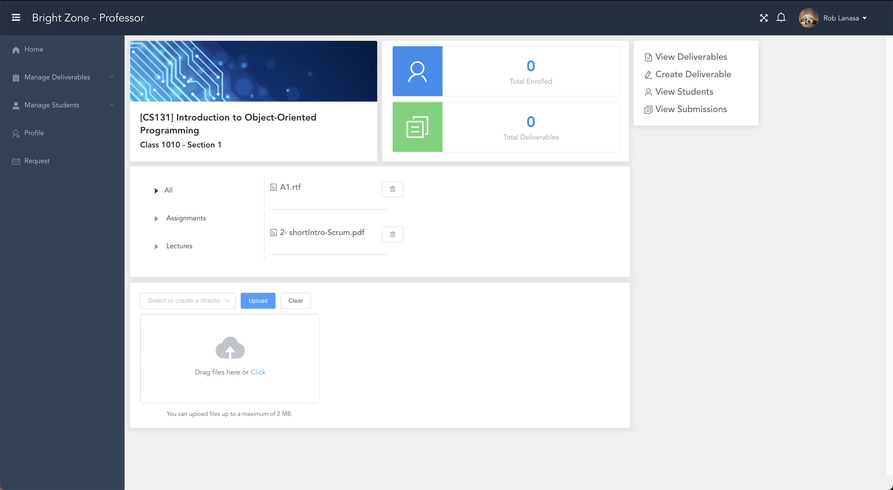
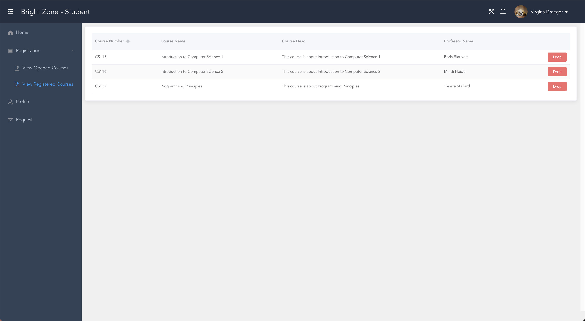

# Brightzone
[](http://badges.mit-license.org)
[](https://travis-ci.org/wallabag/android-app)
> Brightzone is an all-in-one university management system








## Features
- REST API for administrators to manage user accounts, create/cancel courses, create/cancel classes and handle user requests.
- REST API for students to register class, download class materials, submit assignments and view grades.
- REST API for professors to manage deliverables, grade submissions, upload/download/delete class materials.
- Each course can have multiple classes(sections), which can have different deadlines, syllabus, etc.
- Automatic room scheduling and time conflict detecting.  
- Supports concurrent class registrations which take account of prerequisite and preclusion.
- Cucumber + JUnit tests with 100% service layer code coverage
## Requirements
- SpringBoot 2.3.5
- MySQL 8.0

## Project setup
- Run the ``` db_init.sql ``` script to initialize database
- Open ```localhost:8080/populate``` to populate the database
The resulting database with default setting consists of：
    - 5 Admin, 100 Professors, 500 Students and their corresponding Accounts
    - 6 Faculties
    - 5158 Courses
    - 100 Class Rooms with random capacity
    - 89 Classes with random schedule
    - (All data extracted from [uWaterloo Open Data API](https://wiki.uwaterloo.ca/display/UWAPI/OpenAPI+Home+Page))

* This repo only contains the backend source code. [Click here](https://github.com/WenjiuWang/BrightZone-Frontend) to access the frontend repo.